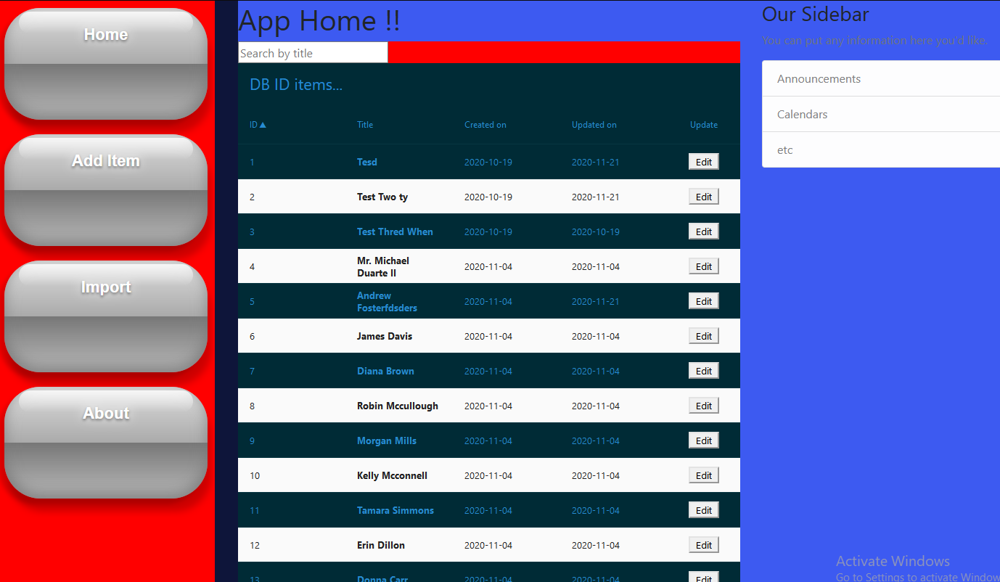

###This is a react app
To get started the easy way see the read me at `/engine/` folder.
To continue and start both react and flask app, read along.

* Run `yarn install` to install the app dependencies.
* Run `yarn start` to run the dev server at `http://localhost:8080` or
`yarn build` to build a production bundle at `/engine/db_id/static/libs/build/`

NB:: if you start the dev server without first starting the flask app, you wil get
a blank page, see step one above

From the app page you can search for titles and get a list with ids (unique)
of all items that match the search term.
You can also edit/update items on this dashboard.

Below app at `/engine/`
