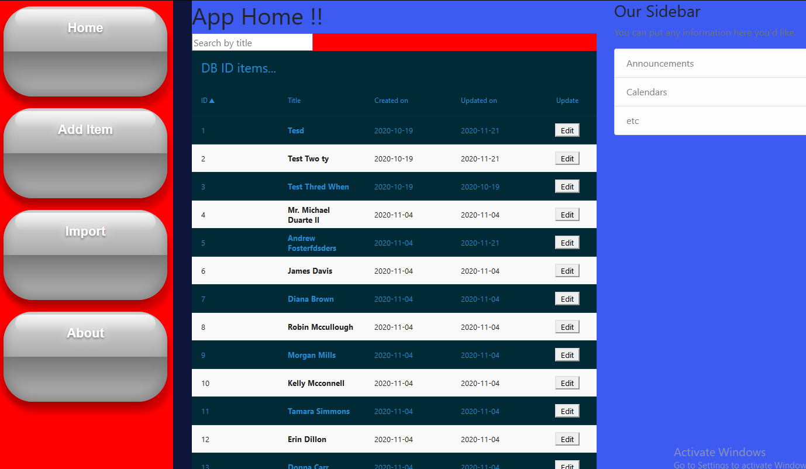

* Install all the app dependencies as defined in the Pipfile in the root of
this dir.

* Run `python eng.py` to start the app at `http://127.0.0.1:5000/`

From the app page you can search for titles and get a list with ids (unique)
of all items that match the search term.

You can also edit/update, add new items on this dashboard.
//TODO:: features/security
